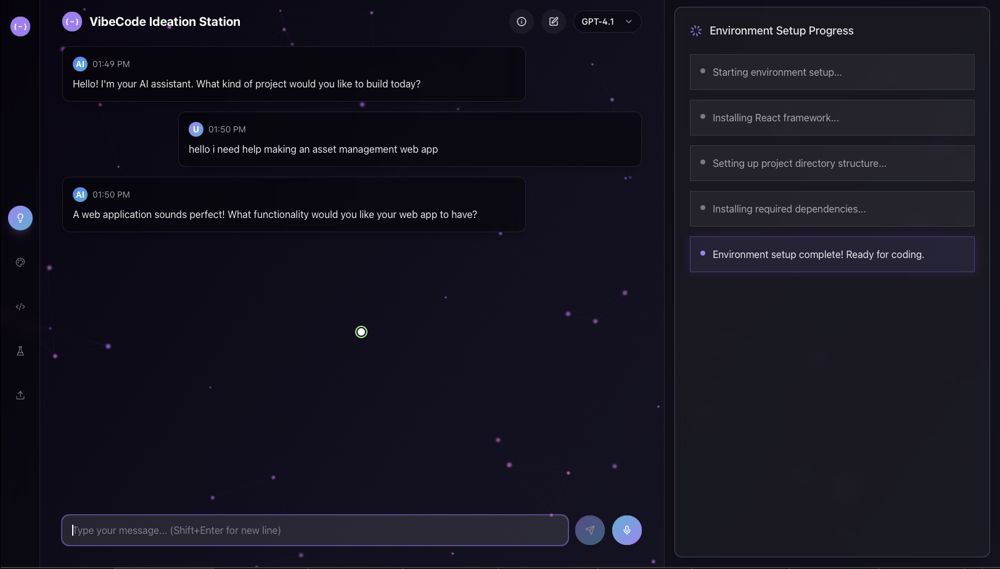
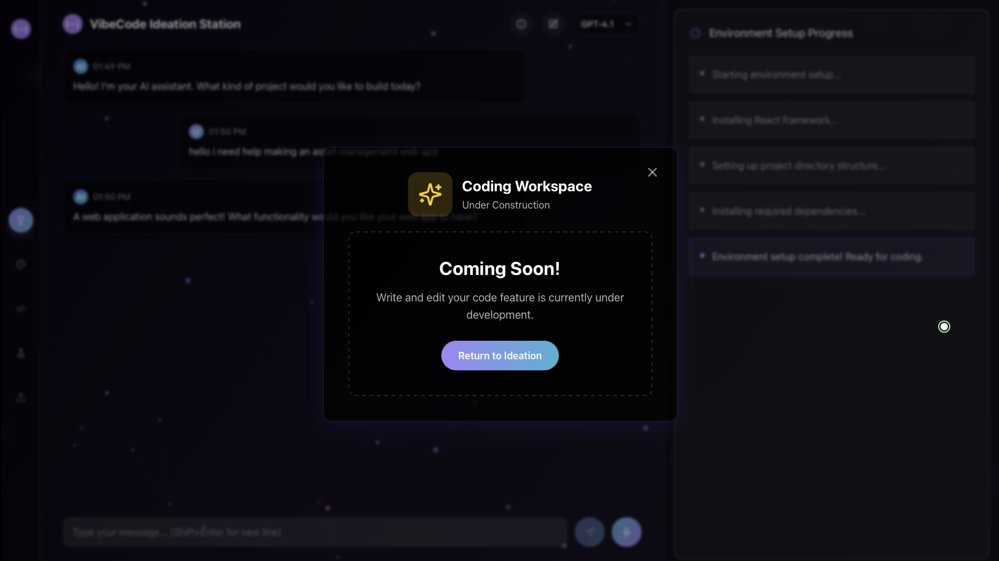

<!-- README.md -->

<h1 align="center" style="color: #4CAF50;"><strong>VibeCode</strong></h1>

Democratizing Software Creation with Voice & Text

 

  <strong>Official Website:</strong> <a href="https://vibecode-website.onrender.com">vibecode-website.onrender.com</a>

  

  VibeCode is an AI‑driven, cloud‑based IDE that lets anyone—beginners, hobbyists, small businesses—describe their software ideas in plain English or voice and watch a fully working project take shape. From ideation through environment setup, coding, testing, and deployment, VibeCode handles the technical heavy lifting so you can stay in the flow.

  

<!-- Screenshots Section -->
<h2 style="color: #f39c12; text-align: center; margin-top: 20px;">Screenshots</h2>

  <!-- Ideation Workspace (Live) -->
  

    <h3 style="color: #4CAF50;">✨ Ideation Workspace</h3>
    
    
Speak or type your idea; watch VibeCode spin up your environment and scaffold your project in real time.

  

  <!-- Other Workspaces (Coming Soon) -->
  

    <h3 style="color: #f39c12;">🚧 More Workspaces Coming Soon</h3>
    
    
Development • Testing • Deployment workspaces are on the way—stay tuned!

  

  

  

<h2 style="color: #4CAF50; text-align: center; margin-top: 40px;">🌟 What Is VibeCode?</h2>

  <strong>VibeCode</strong> <em>(noun)</em>: A playful, AI‑powered way to build software by simply describing what you want. Under the hood, a powerful LLM generates code, configures environments, runs tests, and even deploys your app—no installs, no syntax memorization, just pure creative flow.

  

<h2 style="color: #4CAF50; text-align: center; margin-top: 40px;">⚙️ Core Features</h2>
<ul style="font-size: 1.1em; max-width: 800px; margin: 0 auto; line-height: 1.6;">
  <li><strong>Ideation Workspace:</strong> Natural‑language chat & voice, instant project setup, live transcription.</li>
  <li><strong>Development Workspace (soon):</strong> AI‑driven code generation, smart refactors, multi‑file edits.</li>
  <li><strong>Testing Workspace (soon):</strong> One‑click test runs, live error explanations, auto‑fix suggestions.</li>
  <li><strong>Deployment Workspace (soon):</strong> One‑click cloud hosting or executable packaging, step‑by‑step guidance.</li>
  <li><strong>Web Code Environment Canvas:</strong> Side‑dock that shows install commands, framework selectors, algorithms, and pseudocode—ready to copy or run in your sandbox.</li>
  <li><strong>Seamless Collaboration:</strong> Share projects instantly; teammates can contribute via text or voice without touching config.</li>
  <li><strong>Fully Online:</strong> Cloud sandboxes, no local setup. Switch between dark/light mode with a single click.</li>
</ul>

  

<h2 style="color: #4CAF50; text-align: center; margin-top: 40px;">📦 Getting Started</h2>

  <strong>1. Clone the repo:</strong>
  <pre><code>git clone https://github.com/BENi-Aditya/VibeCode.git</code></pre>
  <strong>2. Install dependencies:</strong>
  <pre><code>cd VibeCode &amp;&amp; npm install</code></pre>
  <strong>3. Add your OpenAI or Gemini key to <code>.env</code> (see sample below).</strong>
  <pre><code>VITE_APP_OPENAI_API_KEY=sk-…  
VITE_APP_DEFAULT_MODEL=gpt-3.5-turbo  
VITE_AI_CHAT_ENDPOINT=https://your-backend.example.com/api/ai/chat</code></pre>
  <strong>4. Run in dev mode:</strong>
  <pre><code>npm run dev</code></pre>

  

<h2 style="color: #4CAF50; text-align: center; margin-top: 40px;">📱 Official Links &amp; Contact</h2>

  🌐 Live Site: <a href="https://vibecode-website.onrender.com">vibecode-website.onrender.com</a> 
  🔗 GitHub: <a href="https://github.com/BENi-Aditya">BENi-Aditya</a> 
  📸 Instagram: <a href="https://instagram.com/aditya.beni_">@aditya.beni_</a> 
  ▶️ YouTube: <a href="https://www.youtube.com/@BENi-Aditya">BENi-Aditya</a>

  

  Made with ❤️ by Aditya Tripathi — building in public and testing the limits of VibeCoding.

